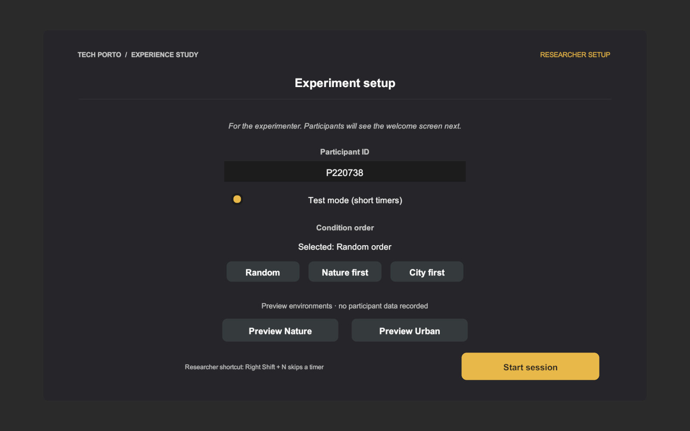
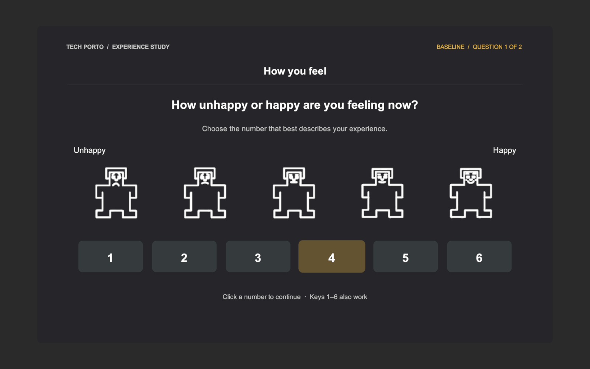
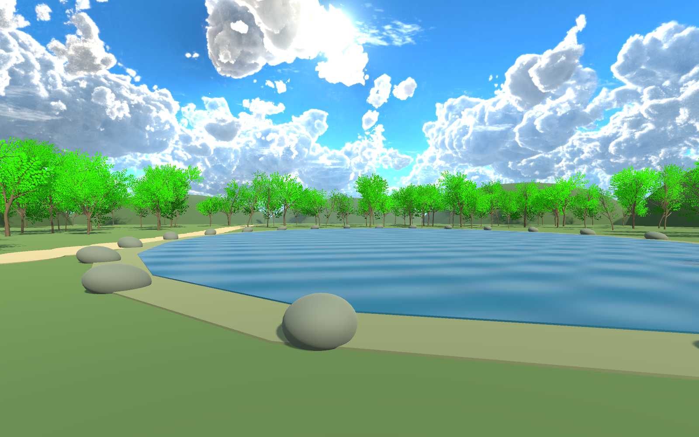
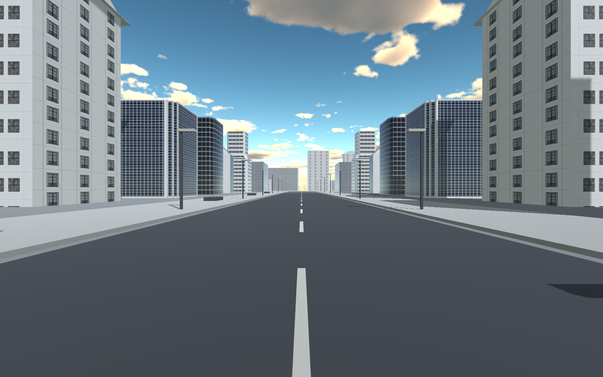

# UI and condition scenes

Open `Assets/Scenes/SampleScene.unity`, press Play, and use **Preview Nature** or
**Preview Urban** on the researcher setup screen. Hold the right mouse button and
drag, or use arrow keys, to look around. Back to setup exits without logging data.
For the full experiment, enter the participant ID and press Start session.
Uncheck Test mode to use 180-second baselines and 300-second conditions.

## UI

The interface uses large, high-contrast text, rounded response buttons, hover and
keyboard focus feedback, question progress, keyboard shortcuts 1–6, and a brief
selection confirmation. Five distinct SAM anchors remain separate from the six
response buttons. Duplicate clicks cannot submit a second answer.

## Nature

`Assets/Experiment/Scenes/ConditionA_Nature.unity` uses trees from the locally
installed Stylized Nature Environment package, alongside a blue lake, curved
shore and path, stones and rounded hills.

There are now 200 trees (80 original + 120 additional), with gentle sway and
animated lake ripples. Tree roots and the seated viewpoint stay fixed. The
NatureAmbientMotion component exposes the movement settings. Nature uses
`Assets/SkySeries Freebie/6SidedFluffball.mat` for its skybox.

The preview above predates the latest skybox assignment (6SidedFluffball).

## Urban

`Assets/Experiment/Scenes/ConditionB_Urban.unity` uses the installed WhiteCity
building prefabs, with straight roads, sidewalks, lamps and concrete seating.
Urban / tower uses `Assets/SkySeries Freebie/DayInTheClouds.mat` for its skybox.
Both cameras now use mouse sensitivity 2.5, increased from 2.0.

The preview above predates the latest skybox assignment (DayInTheClouds).

## Timing and verification

Conditions load as additive scenes. The first 60 seconds include instructions,
free desktop looking, and the 3–2–1 countdown. The beep and event marker begin
the 240-second still phase. The desktop camera returns to its forward view;
prompts clear after a few seconds. Scene loading is outside the timed exposure.

Unity compiled the runtime and editor scripts. Both scenes rendered with zero
missing or unsupported materials. The Play-mode check passed both previews,
all 12 ratings, Valence-to-Arousal transitions, both conditions, duplicate-click
protection and CSV export. Test-mode measured durations were 12.017s for Nature
and 12.010s for Urban, with phase changes at 2.402s and 2.412s respectively.
The full ten minutes were not exercised in the automated short run.

See [scene check](Previews/scene-report.txt) and [flow check](Previews/flow-report.txt).
The subsequent environment check verified 200 trees, changing sway rotations,
fixed root/camera positions, advancing ripple time, the water shader, both saved
skyboxes and mouse sensitivity 2.5. See the [environment update](Previews/enhancement-report.txt).
Synthetic test data stays under `Temp/ExperimentPreviews`, outside participant
storage. Checks can be rerun from **Experiment > Verify**.

No sound recording is bundled. Each condition root exposes an optional
Soundscape field for a supplied recording. The imported packages are unchanged;
new scenes and supporting materials live under `Assets/Experiment`.

Desktop preview uses mouse/keyboard and an overlay canvas. The Quest integration
adds a seated OpenXR rig, controller input and world-space panels. See
[Quest setup](Quest-setup.md) for building, controls, data retrieval and the
remaining physical headset validation.
